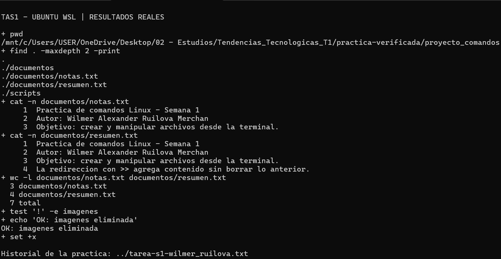

# TAS1 - Estructura Linux

Autor: Wilmer Alexander Ruilova Merchan
Asignatura: Tendencias Tecnológicas — Semana 1
Fecha: 8 de octubre de 2026


## 1. Titulo
Creación y manipulación de archivos y directorios desde la terminal de Linux.

## 2. Tiempo de duración
La sesión automática de ejecución y verificación duró aproximadamente 0,02 minutos (un segundo). El tiempo de estudio y revisión debe completarlo el estudiante.

## 3. Fundamentos
La interfaz de línea de comandos permite comunicarse con el sistema operativo mediante instrucciones escritas. En Linux, una shell interpreta esas instrucciones y ejecuta programas o funciones internas. En esta práctica se utilizó Bash dentro de Ubuntu con WSL 2. Este entorno permite trabajar con herramientas de Linux desde Windows, sin reiniciar el equipo para cambiar de sistema operativo. La fundamentación de la materia relaciona esta habilidad con la administración de servidores y el despliegue de aplicaciones.

El sistema de archivos organiza la información en directorios. Una ruta identifica la ubicación de un archivo o una carpeta. Las rutas absolutas parten de la raíz del sistema, mientras que las relativas se interpretan desde el directorio actual. Por eso conviene consultar `pwd` antes de operar y usar `ls` para comprobar qué elementos existen. El comando `cd` cambia el directorio de trabajo y `mkdir` crea carpetas. En esta actividad, la organización inicial separó documentos, imágenes y scripts dentro de una carpeta común.

Los archivos también se pueden gestionar desde la terminal. `touch` crea un archivo vacío si no existe; si existe, actualiza sus marcas de tiempo. `echo` escribe texto en la salida estándar. `cp` copia un archivo conservando el original, mientras que `mv` permite moverlo o cambiar su nombre. La diferencia se observó al copiar las notas a scripts, renombrar la copia y trasladarla después a imágenes.

La redirección permite enviar la salida de un comando a un archivo. El operador `>` crea el archivo o reemplaza su contenido anterior. En cambio, `>>` añade información al final sin borrar lo existente. Se utilizó `cat` para leer las notas y enviar su contenido al resumen; después se agregó una cuarta línea. Una tubería, representada por `|`, conecta la salida de un comando con la entrada del siguiente. En `history | tee`, el historial pasa a `tee`, que lo muestra y también lo guarda en un archivo.

La eliminación exige revisar la ruta porque `rm` borra archivos. Para una carpeta vacía se utiliza `rmdir`, que falla si aún contiene elementos. La práctica eliminó solamente la copia creada para el ejercicio y la carpeta que quedó vacía. Finalmente se verificaron la estructura, el número de líneas y la conservación del contenido original.



Figura 1. La captura permite relacionar los conceptos con un ejemplo real: cat lee los archivos, notas contiene tres líneas y resumen conserva esas líneas más una añadida mediante >>. La estructura visible muestra la organización de los documentos en directorios.

## 4. Conocimientos previos
- Diferencia entre archivo, directorio y ruta.
- Navegación básica con `pwd`, `cd` y `ls`.
- Diferencia entre `>`, `>>` y `|`.
- Uso básico de Markdown y repositorios de GitHub.

## 5. Objetivos a alcanzar
- Crear una estructura de carpetas en Linux.
- Escribir, copiar, renombrar y mover archivos.
- Aplicar redirecciones y tuberías.
- Eliminar un archivo y un directorio vacío.
- Documentar la práctica con resultados verificables.

## 6. Equipo necesario
- Computador Windows con Ubuntu en WSL 2.
- Ubuntu 24.04.4 LTS y GNU Bash 5.2.21, comprobados en el equipo.
- Terminal y navegador con acceso a EVA.
- Cuenta de GitHub para publicar la entrega.
- Grabadora para producir el audio MP3 de 60 segundos.

## 7. Material de apoyo
- Fundamentación teórica de Semana 1 en EVA.
- Instrucciones de TAS1 - Estructura linux.
- Plantilla del docente: https://github.com/maguaman2/informe-tendencias

## 8. Procedimiento
Los comandos se ejecutaron en una sesión aislada de Bash. El historial anterior del usuario no se leyó ni se sobrescribió. La carpeta de trabajo fue `/mnt/c/Users/USER/OneDrive/Desktop/02 - Estudios/Tendencias_Tecnologicas_T1/practica-verificada`.

### Paso 1. Crear la estructura
```bash
mkdir proyecto_comandos
cd proyecto_comandos
mkdir documentos imagenes scripts
ls -l
```

### Paso 2. Crear las notas y escribir tres líneas
```bash
touch documentos/notas.txt
echo 'Practica de comandos Linux - Semana 1' > documentos/notas.txt
echo 'Autor: Wilmer Alexander Ruilova Merchan' >> documentos/notas.txt
echo 'Objetivo: crear y manipular archivos desde la terminal.' >> documentos/notas.txt
cat -n documentos/notas.txt
```

### Paso 3. Copiar, renombrar y mover
```bash
cp documentos/notas.txt scripts/notas.txt
mv scripts/notas.txt scripts/backup_notas.txt
ls scripts
mv scripts/backup_notas.txt imagenes/backup_notas.txt
ls imagenes
```

### Paso 4. Redireccionar y añadir contenido
```bash
touch documentos/resumen.txt
cat documentos/notas.txt > documentos/resumen.txt
echo 'La redireccion con >> agrega contenido sin borrar lo anterior.' >> documentos/resumen.txt
cat -n documentos/resumen.txt
```

### Paso 5. Eliminar la copia y el directorio vacío
```bash
rm imagenes/backup_notas.txt
rmdir imagenes
```
Se utilizó `imagenes`, sin tilde, porque así se llama la carpeta creada en las instrucciones iniciales.

### Paso 6. Verificar y guardar el historial mediante una tubería
```bash
find . -maxdepth 2 -print
wc -l documentos/notas.txt documentos/resumen.txt
cmp documentos/notas.txt <(head -n 3 documentos/resumen.txt) && echo 'OK: resumen conserva las tres lineas de notas.'
test ! -e imagenes && test -d scripts && echo 'OK: imagenes eliminada y scripts conservada.'
history | tee ../tarea-s1-wilmer_ruilova.txt
```
El archivo de historial se guarda fuera de `proyecto_comandos`, junto al informe.

## 9. Resultados esperados
La práctica ejecutada produjo esta estructura:
```text
proyecto_comandos/
├── documentos/
│   ├── notas.txt
│   └── resumen.txt
└── scripts/
```
- `notas.txt`: tres líneas.
- `resumen.txt`: cuatro líneas; las tres primeras coinciden con las notas.
- `scripts`: carpeta conservada y vacía tras mover el archivo.
- `imagenes` y `backup_notas.txt`: eliminados según la consigna.
- `tarea-s1-wilmer_ruilova.txt`: historial real de la sesión de práctica.


Figura 2. Captura tomada por el estudiante en Ubuntu WSL: estructura final, notas de tres líneas, resumen de cuatro líneas y comprobación de eliminación del directorio imagenes. El historial completo de creación, copia, cambio de nombre, movimiento y eliminación está en tarea-s1-wilmer_ruilova.txt.

## 10. Bibliografía
Instituto Sudamericano. (2026). *1. Fundamentación teórica* [Material de curso]. EVA. https://eva.sudamericano.edu.ec/mod/page/view.php?id=30431

Instituto Sudamericano. (2026). *TAS1 - Estructura linux* [Consigna de práctica]. EVA. https://eva.sudamericano.edu.ec/mod/assign/view.php?id=32765

maguaman2. (s. f.). *informe-tendencias* [Plantilla de informe]. GitHub. https://github.com/maguaman2/informe-tendencias
